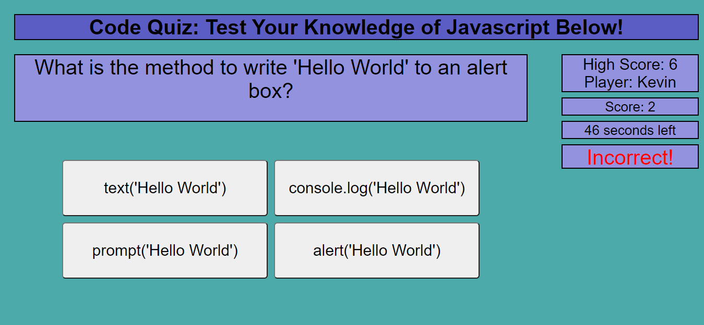
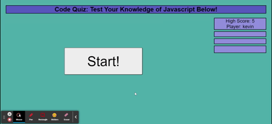

# Code_Quiz

## Task

The main goal of this task was to create a quiz based around knowledge of JavaScript. This involved using objects to store question data and appending them to an array so they could be looped through. On each correct answer, the webpage would show correct in a box next to the game and would advance on to the next question. If an incorrect answer is selected, a box would show incorrect in the box next to the game and would deduct some time from the game timer and advance question. Once time reached 0 or all questions were answered, a game over sceen would show. if you beat the previous high score, you could save your score to local storage (as well as your name) and it would then show next to the game the current high score. On the game over scrrn would be an option to play the game again.

## Screenshots

## Link to Deployed Application

[Link](https://kevinjr1998.github.io/Code_Quiz/)

## License 

MIT

## Contact Info

kevinryner@yahoo.co.uk
